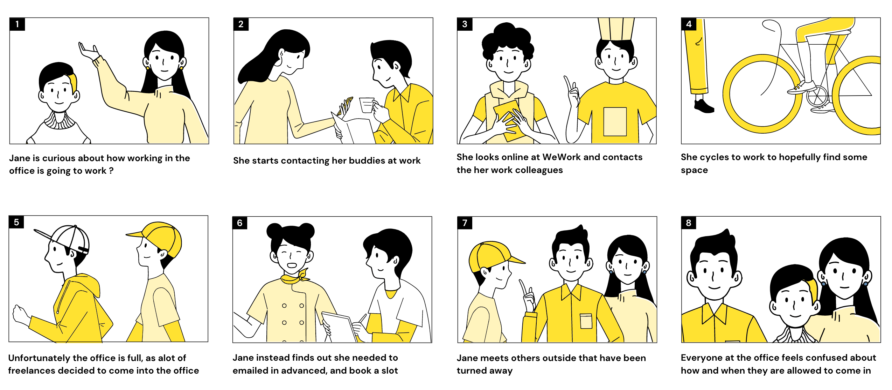
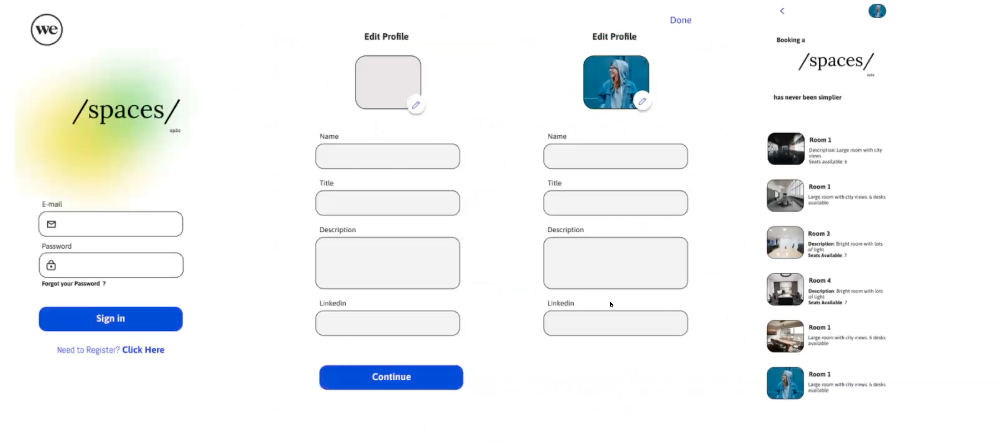

# /your-space/

## Introduction:
What does the future of workspaces look like in a post-pandemic world? As workspaces start to open up, it can be a struggle to find an ideal workspace for freelancers. They need to find a remote-friendly to schedule time in the office. Here's a scenario to consider:

/your-space/ brings the solution to this scheduling problem in the palm of your hands. With this desktop and mobile optimized app, you can set up your profile, check what time slots are available in your co-working space, book a time slot, and easily view when you'll be working next.

### Deployed App:
You can find the deployed app [here.]()

## Collaborators:
- Poppy Neill (UX)
- Saumdel Yba (UX)
- Ida Ogieva (Development)
- Elli Raynai (Development)
- Darren Glew (Development)
- Basma Shahid (Development)

### Figma Wireframe:
Here are some screenshots from the Figma wireframe:

### ERD
You can find the ERD [here.](https://lucid.app/lucidchart/invitations/accept/inv_ddef9c0a-18dc-409d-ab43-be99af739f17?viewport_loc=-356%2C-76%2C2620%2C1269%2C0_0)

### Trello
Throughout the project, we kept a Trello board to map out our features, track our progress, and stay organized as we worked towards creating /your-space/. You can find the Trello board [here.](https://trello.com/b/QsBWQ459/seat-tacker)

### Screenshots

### Technologies Used:
- HTML
- CSS
- Python
- Django
- Amazon Web Services/Amazon S3 Image Upload

### Planning for Future Enhancement
* Implement a "buddy system" so users can add other users and view whether they will be working at the same time. 
* Add more workspaces into the app so users can have a variety of options.
* Improve the overall user flow and ensure that the user experience is smooth and intuitive.
